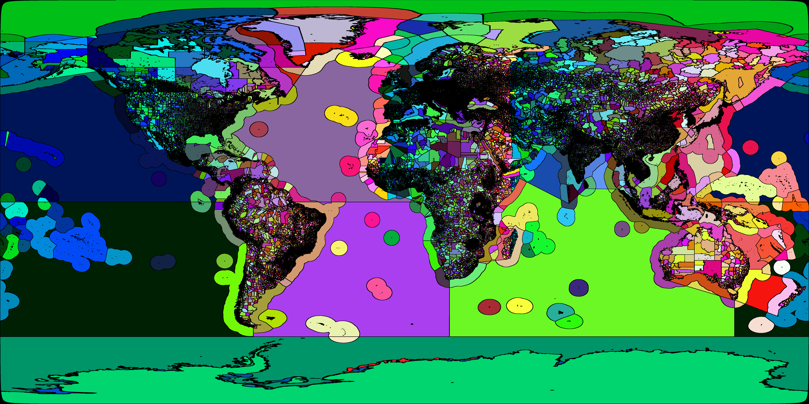

# geocode-ws

RESTful service that provides the reverse geocode functionality. The REST resource should be accessible at this URL: `http://{server}:{httpPort}/reverse`.

## How to build this project

No credentials are hardcoded. You can provide credentials in one of multiple ways:

 - Change the src/resources/geocode.properties file

 - Provide the connection details on the command line while running Maven:
    ```-Dgeocode-ws.url=<url> -Dgeocode-ws.username=<user> -Dgeocode-ws.password=<password>```

 - Provide the connection details in a profile in your settings.xml file:

```xml
<profile>
  <id>geocode-ws</id>
  <properties>
    <geocode-ws.url></geocode-ws.url>
    <geocode-ws.username></geocode-ws.username>
    <geocode-ws.password></geocode-ws.password>
  </properties>
</profile>
```

Then start Maven with this profile: `-Pgeocode-ws`

### Building

To build the WebService just execute Maven this way:

```mvn clean package```

And make sure to provide database credentials in one of the ways mentioned above.

## Testing

To run the WebService in a local Jetty instance run

```mvn jetty:run```

And make sure to provide database credentials in one of the ways mentioned above.

Then go to: http://localhost:8080/geocode/reverse?lat=55.68&lng=12.00

Response should be:

```json
[
  {
    "title": "PA:6",
    "id": "6"
  }
]
```

## Create Database

At the moment we have two sources of data: Natural Earth and EEZ.

See [../database/scripts/import.sh](../database/scripts/import.sh) for a script to import the database. With appropriate environment variables, it can be used against non-Docker databases.

## Map image for faster lookups

There is a PNG image used to speed up queries — after an initial query, roughly 95% of the world's area can be determined without referring to the database at all.



See [Map Image Lookup](./MapImageLookup.md) for how the image is created.

## How to run this service

This service is based on the [gbif-microservice](https://github.com/gbif/gbif-microservice) project which means that the
jar file can be executed using the parameters described in the [gbif-microservice](https://github.com/gbif/gbif-microservice)
project; additionally, this service requires a logback.xml file in the `conf` directory located at same level where the
jar file (such directory is added to the application classpath).
